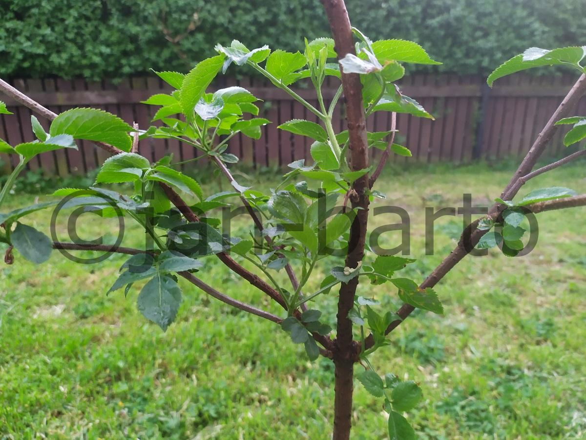

# Desktopová aplikace pro přidání vodoznaku
### (Python, Tkinter, Pillow)
#### Obsahem jsou 3 verze:
a) verze vkládající text vodoznaku pomocí "canvas.create_text" a s výstupem jako snímkem obrazovky pomocí ImageGrab (PIL),
zmenší formát obrázku a vloží vodoznak  
b) totéž ve verzi OOP  
c) OOP verze vkládájící text vodoznaku pomocí "ImageDraw" z knihovny Pillow, formát je zachován  

->

